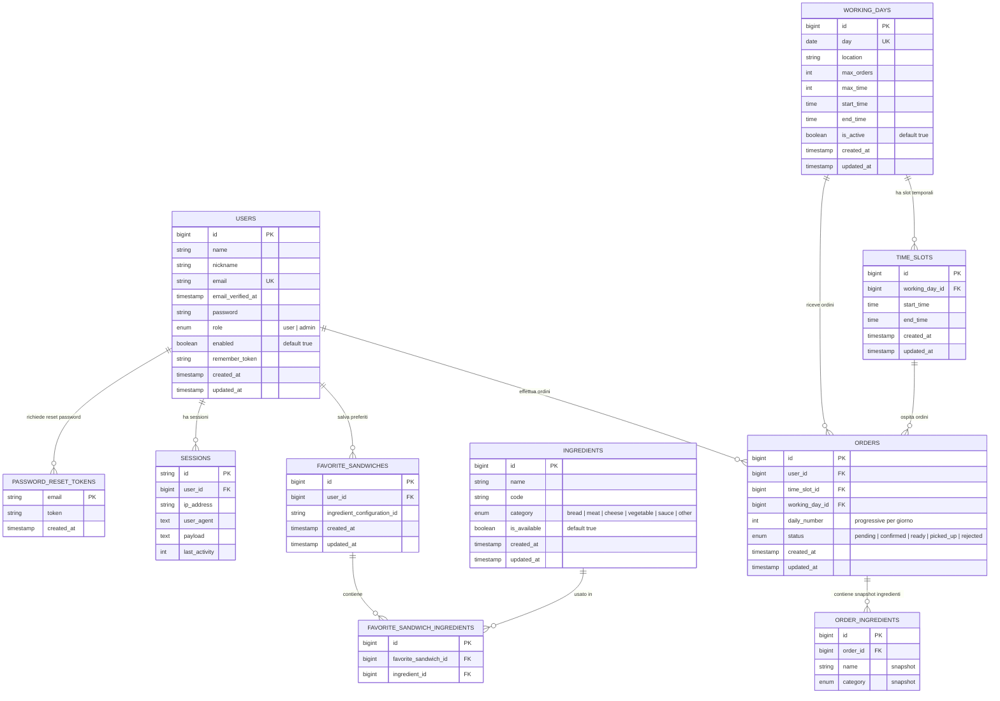

# Database Entity-Relationship Diagram

Questo diagramma rappresenta la struttura del database dell'applicazione **Paninaro** basata sulle migration presenti nella directory `database/migrations`.

## Note Architetturali

### Gestione Ordini
- **daily_number**: Numero progressivo giornaliero degli ordini, garantisce unicità tramite constraint `UNIQUE(working_day_id, daily_number)`
- **order_ingredients**: Snapshot degli ingredienti al momento dell'ordine per storicizzazione
- Gli ordini sono legati sia a `time_slot_id` che a `working_day_id` per ottimizzare le query

### Panini Preferiti
- **ingredient_configuration_id**: Identificatore univoco della configurazione di ingredienti (16 caratteri)
- Relazione many-to-many tra `favorite_sandwiches` e `ingredients` tramite pivot table

### Giorni Lavorativi
- **is_active**: Flag per attivare/disattivare giorni senza eliminarli
- **max_orders** e **max_time**: Limiti configurabili per la gestione del carico di lavoro
- Ogni giorno ha più **time_slots** per gestire la distribuzione degli ordini

### Utenti
- **enabled**: Flag per disabilitare utenti senza eliminarli
- **role**: Enum per distinguere utenti normali da amministratori

### Ingredienti
- **is_available**: Gestione della disponibilità senza eliminazione fisica
- **category**: Categorizzazione per facilitare l'organizzazione nel form di ordine
